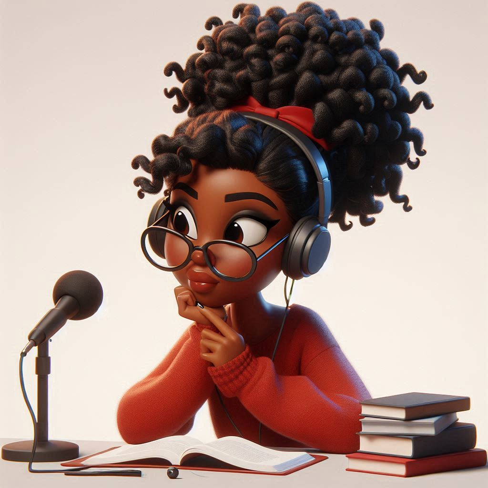

<p align="center">

</p>

<div align="center">
    <audio src="output/podcast.mp3" controls title="Podcast"></audio>
</div>

```markdown
# Podcast - Habilidades de Freire com Hooks

## 📒 Descrição
Este é um projeto de criação de um podcast usando IAs Generativas tanto para a criação de texto, como áudio e imagem.


O objetivo do podcast "Habilidades de Freire com Hooks" é ajudar as pessoas a descobrirem seus estilos de aprendizagem e encontrar as melhores técnicas para aprender algo novo ou se aperfeiçoar. Inspirado pelos ensinamentos de Paulo Freire e Bell Hooks, o podcast busca:

1. **Educar**: Informar os ouvintes sobre os diferentes estilos de aprendizagem e como identificar o seu próprio estilo.
2. **Inspiração**: Motivar os ouvintes a adaptar suas técnicas de estudo de acordo com seus estilos de aprendizagem, tornando o processo mais eficiente e agradável.
3. **Transformar**: Promover um aprendizado engajado, crítico e significativo, que transforme a forma como os ouvintes abordam a educação.
4. **Empoderar**: Oferecer ferramentas e conselhos práticos para que os ouvintes possam perseverar em suas jornadas de aprendizado e se tornar agentes de mudança em suas próprias vidas e comunidades.


## 🤖 Tecnologias Utilizadas
- [ChatGPT](https://chat.openai.com/) 
- [DALL·E 3](https://www.bing.com/images/create/?ref=hn)
- [ElevenLabs](https://beta.elevenlabs.io/)

## Ferramentas de gravação e edição de áudio
- [Kdenlive](https://kdenlive.org/en/)
- [OBSStudio](https://obsproject.com/pt-br/download)

## 🧐 Processo de Criação
Para gerar o podcast criei prompts diferentes para título, saudações e despedida, para gerar o conteúdo e para gerar a capa do projeto. Abaixo mostro cada um deles com seus respectivos links:


- 1. [Prompts](src/prompts/chatgpt.md) de roteiro no `chagpt`
- 2. [Prompts](src/prompts/roteiro-gerado-pelo-chatgpt.md) de roteiro gerados pelo chatgpt para ser lido no  `ElevenLabs`
- 3. [Prompts](src/prompts/dalle.md) de artes no `DALL·E 3`

## 🚀 Resultados
### [Confira o Podcast](/src/output/podcast.mp3)
Vale salientar que a música de fundo utlizada pertence e foi criada por [Kevin McLeod](https://youtu.be/TRiBpYgjFD4?si=0l9X5kDHDyb1-M5g)

## 💭 Reflexão (Opcional)
Criar um podcast utilizando IAs generativas como ChatGPT, DALL-E 3 e ElevenLabs foi uma experiência incrivelmente positiva e inspiradora. Ao usar o ChatGPT para gerar conteúdos, prompts criativos para títulos, saudações e despedidas, eu pude ver a eficiência e a precisão dessa tecnologia em ação. Além disso, com DALL-E 3, consegui criar uma capa de projeto única e visualmente atraente, enquanto o ElevenLabs me ajudou a polir e aprimorar os elementos de áudio, tudo de maneira rápida e sem esforço. Essas ferramentas mostraram-se inestimáveis ao automatizar tarefas repetitivas e acelerando significativamente os resultados. <br>É importante ressaltar que, em nenhum momento, senti que essas IAs poderiam substituir a criatividade, a emoção e o toque humano que coloco em meu trabalho. Pelo contrário, elas me proporcionaram uma base sólida e eficiente, permitindo que eu me concentrasse nos aspectos mais humanos e criativos do projeto. Sinto-me extremamente segura e confiante em utilizar essas tecnologias, sabendo que estão aqui para nos auxiliar e potencializar nossas capacidades, e não para nos substituir.

```